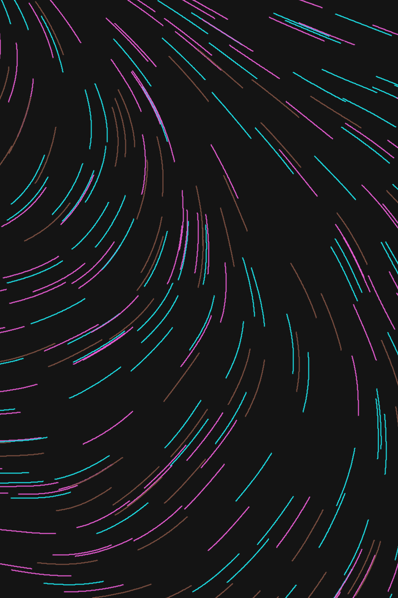
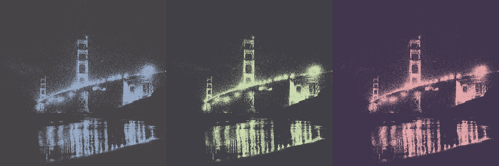
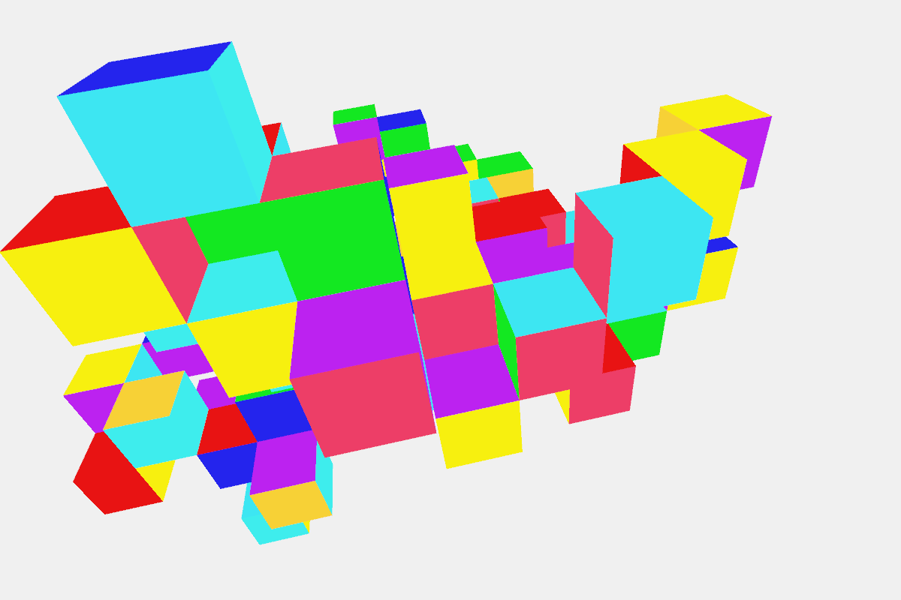

# Genuary

My work for the [Genuary](https://genuary.art) challenge, which is a global challenge for creating generative art. Most of my work was done in [Processing](https://processing.org/).

## Samples

